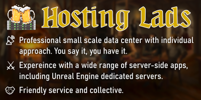

# Continuous Deployment Pipelines (CI/CD) with Dozer

- [Continuous Deployment Pipelines (CI/CD) with Dozer](#continuous-deployment-pipelines-cicd-with-dozer)
  - [Sponsored By](#sponsored-by)
  - [Are you new to CI/CD?](#are-you-new-to-cicd)
  - [Why Dozer?](#why-dozer)
  - [How to use this repo? (and Contribute?)](#how-to-use-this-repo-and-contribute)
  - [Versioning and Changelogs](#versioning-and-changelogs)
  - [Support and Troubleshooting](#support-and-troubleshooting)
- [Available Scripts and Pipelines](#available-scripts-and-pipelines)
  - [Unreal Engine CI/CD Pipelines](#unreal-engine-cicd-pipelines)
  - [Tools](#tools)

## Sponsored By

## Are you new to CI/CD?

Continuous deployment pipelines are sets of scripts and tools helping you get your project from your workstation, or version control system, to somewhere your target audience can reach it.

*Ah, OK. Well, my project is still in development, I probably don't need this yet.*

The truth is that if you are serious about the project, you should incorporate a CI/CD pipeline in it before you start its development. Having your project working on your local workstation doesn't mean it will be working on your user's device. Believe it or not, the gap between locally working software and software working in a foreign environment is larger than you think. The more changes you make to your project before you test it on the users' devices, the more likely there's going to be an issue. The more issues there will be, the more complex it will get to resolve. Each additional issue to resolve at once will add to the blur of your knowledge about *what worked before*.

Therefore, professional software developers learned to deploy and test their software in target environments, ideally after each new feature or bug fix. So they always know what worked before and where to look to resolve an issue that may appear.

But in this world of app stores, making frequent app releases may account up to 50% of your time spent on development. Every time you want to make a release of your app, you need to do a sequence of tasks (build, test, pack, upload, fill release info, publish release). This quickly gets repetitive and kills your creative enthusiasm.

Fear no more, CI/CD pipelines automate all this stuff for you. Just trigger the red button, grab a coffee, and watch things get done.

## Why Dozer?

[Dozer](https://github.com/kasp1/Dozer), unlike most CI/CD solutions, can be run be independently set up on your local machine. You can easily test your deployment pipeline locally before copying it to a cloud-based CI/CD solution (or running your tested Dozer pipeline on your build server).

Also, if you are building your CI/CD pipeline with another runner than Dozer, you can feel free to copy any scripts from this repository, and use them there, or just use this repository as learning resource.

## How to use this repo? (and Contribute?)

Clone/unzip everything under `yourProjectRoot/CI/shared`.
* `shared/sample-pipelines` contains sample pipelines.
* `shared/tools` contains the scripts these pipelines use.

When you decide you want to alter any pipeline or script for your specific purpose you should copy it from `CI/shared` to `CI` and use it from there.

If you want to make any changes to the scripts or pipelines that you would like to share with others, you should keep them under `CI/shared` and create a pull request to this repository when you are ready.

## Versioning and Changelogs

The pipelines in this repository rely on [semantic versioning](https://semver.org/) to make your deploys as few efforts as possible, which means you will need to install Git. Dang... yeah, that evil Git thing again. The benefits it brings in a CI/CD environment will make you love Git, though.

Let's take a moment to explain why semantic versioning is so beneficial. When you create a new release in Google Play, or basically any application store, you are usually required to (and usually you want to) fill in the release version and release notes (changelog). This is something that no CI/CD script can do for you as of these days because what you fill into these fields are solely your own thoughts.

So practically, a CI/CD pipeline can upload the build for you, and then you still have to open Google Play Console and fill in this info for each release.

But! A Git-versioned project with semantic messages can be understood by a simple script, which can easily compile your commit messages into a changelog, and decide your next app's version according to what changes you made. Then fill in this info for you automatically.

> In a semantically versioned project, the project version always starts at `1.0.0`.
> * When you commit a project-code unrelated change, e.g. configuration change (`chore: `, `build: `) or change to the CI/CD pipeline (`ci: `, `build: `), the version doesn't change.
> * When you commit a bug fix (`fix: ...`), the last number will increase (e.g. `1.0.1`).
> * When you commit a new feature (`feat: ...`), the middle number will increase (e.g. `1.1.0`).
> * When you commit any backward-incompatible change, the first number will increase (e.g. `2.0.0`). A backward-incompatible change is, for example, when your game can no longer read save files of previous versions of your game because you changed the structure of the save files.

This kind of versioning may seem a bit counter-intuitive at first since a lot of developers are used to version things starting from `0`, e.g. `0.1`, and call it `1.0` when the software product feels like a *beta*. Production *readiness* in semantic versioning is usually done by appending *stage* or even git branch after the version, e.g. `1.2.3-alpha`. I (Mirek) don't personally worry about this. Also, semantically versioned projects often quickly reach quite high first numbers of the version, e.g. `11.1.3`. This is all pretty common, and if you find it strange, you better just forget to judge software maturity by the version number but by the features it provides instead.

## Support and Troubleshooting

Preferably, [create a new issue](https://github.com/kasp1/dozer-pipelines/issues), so when others search the same problem, search engines will take them there.

You can also try searching in the issues. Chances are somebody already faced the same problems as you do at the moment.

...or come to Discord: https://discord.gg/TwnpfKVzGH

Please star this repository if you find it helpful.

# Available Scripts and Pipelines

## Unreal Engine CI/CD Pipelines

* [Unreal Engine to Microsoft Store](sample-pipelines/microsoft-store)
* [Unreal Engine to Google Play](sample-pipelines/google-play)
* [Unreal Engine to Steam](sample-pipelines/steam)
* [Unreal Engine Code Plugin to Unreal Engine Marketplace](sample-pipelines/unreal-marketplace-code-plugin)

## Tools

TBD
