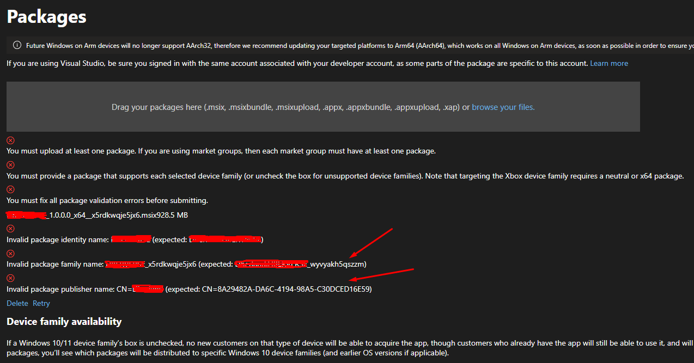

# Intro

This is a set of scripts to help you release your Unreal Engine project on the Microsoft Store continuously (CI/CD), from either your workstation or your build server, using [Dozer, the CI/CD runner](https://github.com/kasp1/Dozer). The pipeline is built for being run on Windows 10+.

For support, please see the [main README page](https://github.com/kasp1/dozer-pipelines).

**Table of Contents**


- [Intro](#intro)
- [Required Environment](#required-environment)
- [Setup](#setup)
  - [Configure Your UE Project Settings](#configure-your-ue-project-settings)
  - [Initialize Git](#initialize-git)
    - [Getting *Commitizen*](#getting-commitizen)
  - [Get the Pipeline Scripts](#get-the-pipeline-scripts)
  - [Initialize NPM](#initialize-npm)
  - [Configure the Pipeline](#configure-the-pipeline)
- [Make a Script to Run the Pipeline](#make-a-script-to-run-the-pipeline)
- [Tips](#tips)
  - [Customizing the Pipeline](#customizing-the-pipeline)
  - [Creating Just a Distributable Installer](#creating-just-a-distributable-installer)


# Required Environment

Besides an Unreal Engine installation (either the launcher or source version), and a project to deploy, you will need:

- [Git](https://git-scm.com/)
- [NodeJS](https://nodejs.org/)
- [Dozer](https://github.com/kasp1/Dozer) (don't forget to install Dozer as Administrator)
- [Windows SDK](https://developer.microsoft.com/en-us/windows/downloads/windows-sdk/), after you install the SDK, you need to find the directory containing `makepri.exe` and `makeappx.exe` and add the directory to the system `path`, usually something like `C:\Program Files (x86)\Windows Kits\10\bin\10.0.22621.0\x64`

Optional handy stuff: 
- A decent code editor, [Visual Studio Code](https://code.visualstudio.com/) for instance.

Obviously, you will also need to have a [Microsoft Partner](https://partner.microsoft.com/dashboard) account set up, and an app under Steamworks.

# Setup

## Configure Your UE Project Settings

Under *Project Settings* > *Project* > *Description*:
- Set *Project Version* to exactly `1.0.0`


## Initialize Git

Your project needs to be versioned by Git for the purposes of this pipeline. If you haven't done so yet, run the `git init` command in your repository.

After each significant change in your project, you should make a git commit with a semantic commit message (see [https://semver.org/](https://semver.org/)). In practice, this means commit messages like:
```
feat: added a sniper rifle to the game
```
which would translate in commit command:
```
git commit -m "feat: added a sniper rifle to the game"
```

You can either use the Unreal Editor to make such commit messages, or alternatively, you can use a command line tool for making semantic commits called *Commitizen*. After installing this tool, you effectively gain a new Git command. Instead of running `git commit -m "message"`, you run `git cz`, which fires up a wizard guiding you through making a semantic commit message.

[Why you will love semantic versioning with Git?](https://github.com/kasp1/dozer-pipelines#versioning-and-changelogs)

### Getting *Commitizen*
```
npm install -g commitizen
```

## Get the Pipeline Scripts

All contents of this directory are supposed to sit under the `CI/shared` folder in the root of your Unreal Engine project. Just click the *Code* button at the top of this page and select the *Download ZIP* option. Then extract everything to `your_UE_project/CI/shared`.

Alternatively, you can run the following command from the root of your Unreal project to clone the pipeline scripts from this repository under the CI folder as a Git submodule:

```
git submodule add https://github.com/kasp1/dozer-pipelines.git CI/shared
```

## Initialize NPM

NPM is a package manager installed with NodeJS by default. Since this pipeline uses NodeJS to run the automation scripts, we will need to install some NodeJS packages using NPM.

Copy `yourProject/CI/shared/sample-pipelines/sample-package.json` to `yourProject/package.json`.

Then run the following command in your project's root:

```
npm install
```

All the necessary packages should get installed automatically.

> The newly created `node_modules` folder in your project root should be excluded from Git versioning (add it to .gitignore), while the `package.json` and `package-lock.json` files should be included in Git versioning.

## Configure the Pipeline

The pipeline needs to know some specific info about your project. Copy `yourProject/CI/shared/sample-pipelines/microsoft-store/vars.bat` to `yourProject/CI/vars.bat` and edit its contents to correspond with your project.

This file is a simple key-value setting script.

- **CI_UE_HOME** - path to your local Unreal Engine installation
- **APP_NAME** - app name.
- **MSIX_EXE** - what UE generates as the entry executable, basically the name of your `.uproject` file with the `.exe` extension.
- **MSIX_RESOURCES** - path to directory with app-related images.
- **MSIX_LOGO_44** - 44x44px logo image located in the `MSIX_RESOURCES` directory.
- **MSIX_LOGO_150** - 150x150px logo image located in the `MSIX_RESOURCES` directory.
- **MSIX_APPLOGO** - logo image located in the `MSIX_RESOURCES` directory.
- **MSIX_BGCOLOR_HEX** - background color used IDK where.
- **PUBLISHER** - publisher name.
- **PUBLISHER_ACCOUNT** - publisher name as you have set up in the MS Partner Dashboard, perhaps same as `PUBLISHER`. 
- **PUBLISHER_FAMILY** - usually looks like `_someLettersAndNumbers`. 
- **PUBLISHER_UUID** - usually looks like `XXXXXXXX-XXXX-XXXX-XXXX-XXXXXXXXXXXX`.

I don't know where else to find the correct values of `PUBLISHER_FAMILY` and `PUBLISHER_UUID` other than from errors that the package uploader will give you from the first time:



# Make a Script to Run the Pipeline

From now on, every time you will want to deploy a version of your app to the Microsoft Store, you can simply run the following command in your project's root:

```
dozer CI\shared\sample-pipelines\microsoft-store\deploy.yaml --gui
```

The `--gui` part will also start a graphical interface showing you the progress of the build. Typically you want to start GUI on your workstation but on your build server you will probably want to omit `--gui`.

You can also make a new file in your project's root called `deploy.bat`, and just put this command in it. When you click it, the deployment should automatically start. That's easier than typing the command every time or trying to remember it.

> If you created a file called `deploy.bat`, but it opens as a text file when you click it, instead of starting the pipeline, chances are you have hidden file extensions in Windows, and the file is called `deploy.bat.txt` instead.

Eventually you should find the *MSIX* package as `Distribution/Windows/<package>.msix`. You can take this one and drag & drop it to Microsoft Store.

# Tips

## Customizing the Pipeline

If you need to alter the pipeline (`deploy.yaml`), the best practice is to copy/paste it as `CI/deploy.yaml`. You will also need to edit your `deploy.bat` script to point to the correct `deploy.yaml`.

## Creating Just a Distributable Installer

Follow the guide the same way as if you would want to publish to the Microsoft Store, except you won't need the publishing account. The MSIX package can be used as a distributable installer, it doesn't work just with the Microsoft Store.

You won't have to worry about setting the **PUBLISHER_ACCOUNT**, **PUBLISHER_FAMILY** and **PUBLISHER_UUID** variables. For **PUBLISHER_ACCOUNT** and **PUBLISHER_UUID**, you can use the same value as for **PUBLISHER**.

You may need to [create a certificate](https://learn.microsoft.com/en-us/windows/msix/package/create-certificate-package-signing) and [sign the MSIX](https://learn.microsoft.com/en-us/windows/msix/package/sign-app-package-using-signtool).


